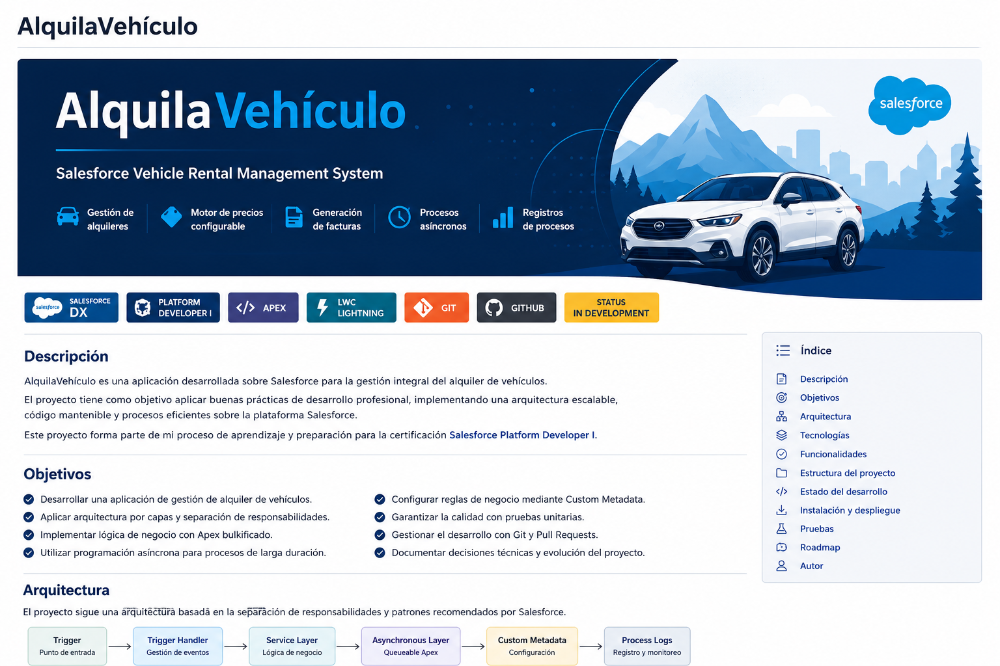

<p align="center">
  
</p>

# AlquilaVehículo

**Salesforce DX | Apex | Lightning Web Components | SOQL/SOSL | Automation | Async Apex**

AlquilaVehículo es una aplicación desarrollada sobre Salesforce para gestionar el alquiler de vehículos.

El proyecto comenzó con una primera versión centrada en la gestión básica de vehículos y alquileres y posteriormente evolucionó con los requisitos de Salesforce Platform Developer Track II, incorporando reglas de negocio, automatización, componentes Lightning, procesamiento asíncrono, seguridad y pruebas.

El objetivo del proyecto ha sido aplicar de forma práctica los conocimientos adquiridos durante mi formación como Salesforce Platform Developer, intentando mantener una estructura clara y entender por qué se utiliza cada herramienta de la plataforma.

## Funcionalidades principales

- Motor de precios configurable mediante Custom Metadata.
- Cálculo automático según vehículo, temporada, duración y fidelidad.
- Penalización por devolución con retraso.
- Validación de disponibilidad y prevención de alquileres solapados.
- Proceso de aprobación financiera según el importe del alquiler.
- Consola Operativa LWC integrada en la página de Account.
- Simulación de precio antes de crear un alquiler.
- Facturación automática mediante Queueable Apex.
- Prevención de facturas duplicadas y registro del proceso.
- Notificación mediante Platform Event y Flow.
- Buscador Global de Flota mediante SOSL.
- Revisión periódica de vehículos mediante Batch y Scheduled Apex.
- Permission Set específico para el usuario operativo.


## Arquitectura

El proyecto intenta mantener separadas las responsabilidades entre la interfaz, la coordinación de las operaciones y la lógica de negocio.

Para las funcionalidades iniciadas desde Lightning Web Components se utiliza principalmente:

`LWC → Controller → Service`

Por ejemplo, la Consola Operativa sigue este recorrido:

`rentalOperationsConsole → VRT_CLS_RentalConsoleController → VRT_CLS_RentalService`

Para las automatizaciones relacionadas con los alquileres se utiliza:

`Trigger → Handler → Service`

El trigger detecta el contexto de ejecución, el Handler coordina las acciones necesarias y los Services contienen la lógica de negocio reutilizable.

El Buscador Global utiliza una estructura más sencilla:

`vehicleSearch → VRT_CLS_VehicleSearchService`

En este caso no se añadió un Controller intermedio porque no aportaba una responsabilidad adicional.

Los procesos posteriores o periódicos utilizan las herramientas asíncronas adecuadas según su finalidad:

- Queueable Apex para la facturación.
- Finalizer para registrar fallos del proceso asíncrono.
- Platform Event y Flow para desacoplar la notificación.
- Batch Apex para procesar grupos de vehículos.
- Scheduled Apex para programar la revisión periódica.

La arquitectura completa y las decisiones tomadas están explicadas en [Arquitectura](docs/architecture.md).

## Tecnologías utilizadas

- Salesforce Platform
- Salesforce DX
- Apex
- Lightning Web Components (LWC)
- SOQL
- SOSL
- Apex Triggers
- Approval Process
- Flow
- Queueable Apex
- Apex Finalizer
- Batch Apex
- Scheduled Apex
- Platform Events
- Custom Metadata Types
- Salesforce Security y Permission Sets
- Apex Testing
- Salesforce CLI
- Git y GitHub
## Testing y calidad

Las principales reglas de negocio disponen de tests Apex, incluyendo escenarios individuales y procesamiento de varios registros.

Durante el desarrollo se han aplicado prácticas como:

- uso de `List`, `Set` y `Map` para trabajar con colecciones;
- consultas SOQL fuera de bucles;
- procesamiento bulk en triggers y Services;
- separación entre Trigger, Handler y lógica de negocio;
- tests sobre Pricing Engine, disponibilidad, control financiero, Consola Operativa, facturación y búsqueda;
- pruebas de procesos asíncronos mediante `Test.startTest()` y `Test.stopTest()`.

Antes de preparar la entrega se realizó una validación completa mediante:

`sf project deploy start --source-dir force-app --dry-run --test-level RunLocalTests --wait 30`

Resultado:

- 73 tests ejecutados.
- 73 tests superados.
- 0 tests fallidos.

La estrategia de pruebas se explica con más detalle en [Testing](docs/testing.md).

## Seguridad

El proyecto incluye el Permission Set:

`VRT_AlquilaVehiculo_User`

Su objetivo es proporcionar al usuario operativo los permisos necesarios sin recurrir de forma general a `View All` o `Modify All`.

La configuración diferencia entre:

- acceso a la aplicación;
- acceso a clases Apex utilizadas desde LWC;
- permisos sobre objetos;
- permisos de lectura y edición sobre campos;
- acceso a registros mediante el modelo de sharing de Salesforce.

Los campos calculados o gestionados automáticamente por la aplicación se mantienen como solo lectura cuando el usuario no necesita modificarlos directamente.

Los puntos de entrada utilizados por los LWC aplican además controles desde Apex, incluyendo `with sharing` y comprobaciones de acceso cuando corresponde.

La estrategia se explica en [Seguridad](docs/security.md).

## Estructura del repositorio

```text
alquilavehiculo/
├── force-app/
│   └── main/
│       └── default/
│           ├── classes/
│           ├── customMetadata/
│           ├── flows/
│           ├── lwc/
│           ├── objects/
│           ├── permissionsets/
│           ├── triggers/
│           └── ...
├── docs/
│   ├── images/
│   ├── architecture.md
│   ├── deployment.md
│   ├── security.md
│   ├── testing.md
│   └── track-ii.md
├── manifest/
├── scripts/
├── sfdx-project.json
└── README.md
```
## Documentación

La documentación técnica del proyecto se encuentra en la carpeta `docs`.

- [Arquitectura](docs/architecture.md) — estructura de la aplicación y decisiones de diseño.
- [Implementación Track II](docs/track-ii.md) — relación entre los requisitos de Track II y la solución implementada.
- [Seguridad](docs/security.md) — Permission Set, permisos de objetos y campos y controles desde Apex.
- [Testing](docs/testing.md) — estrategia de pruebas, bulk testing y validación final.
- [Despliegue](docs/deployment.md) — pasos para desplegar el proyecto y configuración posterior necesaria.

## Despliegue

El proyecto utiliza Salesforce DX y puede desplegarse desde `force-app`.

Antes de realizar un despliegue definitivo se recomienda ejecutar una validación:

`sf project deploy start --source-dir force-app --dry-run --test-level RunLocalTests --wait 30`

Después del despliegue existen configuraciones propias de la org que deben revisarse, como la asignación del Permission Set, la programación de Scheduled Apex, los usuarios participantes en las aprobaciones y la configuración de email.

El proceso completo se explica en [Despliegue](docs/deployment.md).

## Estado del proyecto

Las funcionalidades principales definidas para Track II están implementadas y la versión actual ha superado la validación completa de despliegue con 73 tests locales ejecutados y 0 fallos.

El proyecto puede seguir evolucionando. Entre las posibles mejoras futuras se encuentran un control más avanzado de concurrencia, mayor monitorización de procesos asíncronos y automatización del proceso de integración y despliegue.

## Autor

**Luis Javier Gómez Hernández**

Salesforce Platform Developer I Certified

GitHub: https://github.com/lgomez-h

LinkedIn: https://www.linkedin.com/in/luis-javier-gomez-hernandez/
